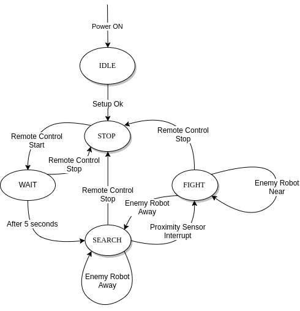

# Proyecto: Desarrollo de un Robot-Sumo para la categoria Autónomo-3Kg.

----------------------------------------------------------------------------------------------------

## Descripción:

El proyecto busca desarrollar un robot que cumpla con los estándares de la competencia japonesa
***All Japan Robot-Sumo Tournament*** en la categoria **Autonomo-3Kg**.

El desafío consta de desarrollar un robot que sea capaz de:
* Iniciar su rutina 5 segundos despues de que se da la orden a través de un control remoto
sólo  para iniciar y detener.
* Una vez iniciada la rutina debe buscar y encontrar de forma autónoma a su adversario.
* Una vez se haya encontrado el contrincante, el robot debe ir a su envestida para lograr
sacarlo del escenario (aquí se debe implementar toda la lógica asociada a la estrategia de
combate escogida).
* El robot debe ser capaz de detectar el borde del escenario por si solo.
* El robot debe ser capaz de detenerse inmediatamente despues de recibir la orden del
control remoto para iniciar y detener.

Para llevar a cabo esta tarea será necesario integrar todos los conocimientos adquiridos en el ramo,
además de la investigación de modulos nuevos que aportan al mejor desempeño de este desarrollo.

----------------------------------------------------------------------------------------------------

### Listado de componentes a utilizar.
* uC MSP430.
* Driver de Motor dual channel.
* Sensor de proximidad infrarojo (digital).
* Sensor de linea (digital).
* IMU de 6DOF (3-accelerometer + 3-gyroscope).
* Módulo de comunicación inalámbrica (RF o BT).

----------------------------------------------------------------------------------------------------

### Propuesta de Desarrollo.

Se desarrollará un programa en C/C++ que contempla la reutilización de código usado en las
experiencias del laboratorio, tales como, Módulo Generador de PWM, Interrupciones de Puertos
de Entrada/Salida, Módulo UART0 y UART1. Adicionalmente a esto, se implementará una Máquina de 
Estado Finito como la que se muestra a continuación.

Ésta máquina de estados contempla el comportamiento macro del robot y la interacción con el usuario.

Se implementará también otra máquina de estados que defina la estrategia de búsqueda del adversario
en función de una combinación de switches que será seteada antes del encendido del robot.

