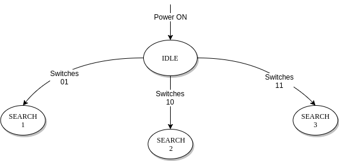
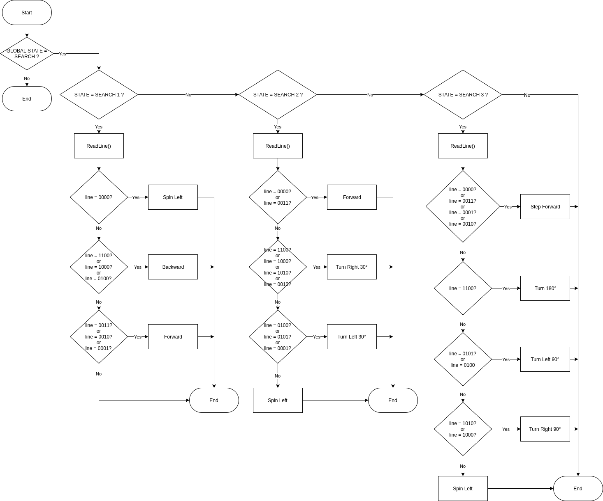
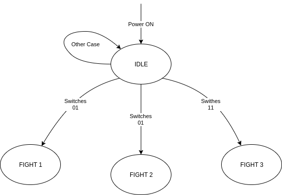

# Proyecto: Desarrollo de un Robot-Sumo para la categoria Autónomo-3Kg.

----------------------------------------------------------------------------------------------------

## Descripción:

El proyecto busca desarrollar un robot que cumpla con los estándares de la competencia japonesa
***All Japan Robot-Sumo Tournament*** en la categoria **Autonomo-3Kg**.

El desafío consta de desarrollar un robot que sea capaz de:
* Iniciar su rutina 5 segundos despues de que se da la orden a través de un control remoto
sólo  para iniciar y detener.
* Una vez iniciada la rutina debe buscar y encontrar de forma autónoma a su adversario.
* Una vez se haya encontrado el contrincante, el robot debe ir a su envestida para lograr
sacarlo del escenario (aquí se debe implementar toda la lógica asociada a la estrategia de
combate escogida).
* El robot debe ser capaz de detectar el borde del escenario por si solo.
* El robot debe ser capaz de detenerse inmediatamente despues de recibir la orden del
control remoto para iniciar y detener.

Para llevar a cabo esta tarea será necesario integrar todos los conocimientos adquiridos en el ramo,
además de la investigación de modulos nuevos que aportan al mejor desempeño de este desarrollo.

----------------------------------------------------------------------------------------------------

### Listado de componentes a utilizar.
* uC MSP430.
* Driver de Motor dual channel.
* Sensor de proximidad infrarojo (digital).
* Sensor de linea (digital).
* IMU de 6DOF (3-accelerometer + 3-gyroscope).
* Módulo de comunicación inalámbrica (RF o BT).

----------------------------------------------------------------------------------------------------

### Propuesta de Desarrollo.

Se desarrollará un programa en C/C++ que contempla la reutilización de código usado en las
experiencias del laboratorio, tales como, Módulo Generador de PWM, Interrupciones de Puertos
de Entrada/Salida, Módulo UART0 y UART1. Adicionalmente a esto, se implementará una Máquina de 
Estado Finito como la que se muestra a continuación.

Ésta máquina de estados contempla el comportamiento macro del robot y la interacción con el usuario.

#### Máquina de Estados Global.

Es la máquina de estados descrita en la imagen anterior. A continuación se explicará cada uno de los estados.

##### 1. IDLE:

Estado inicial de la máquina que sólo puede ser accedido al encender el robot. Este estado fija las condiciones
iniciales del sistema completo. Una vez completado el setup, se pasa al estado **STOP**.

##### 2. STOP:

Estado de espera (Standby) que sólo ejecuta la rutina de lectura del módulo de comunicación inalámbrica (UART 0) a la espera del
comando *start* desde el control remoto.

##### 3. WAIT:

Estado que se ejecuta al recibirse la orden *start* desde el control remoto cuyo objetivo es mantener el
robot detenido por los 5 segundos reglamentados por la competencia. Una vez transcurrido dicho tiempo se 
pasa inmediatamente al estado **SEARCH**.

##### 4. SEARCH:

Estado en el que se ejecutará el algoritmo de busqueda del adversario que se haya escogido previamente
mediante la combinación de los switches 0 y 1.

Aqui se implementará también otra máquina de estados que defina la estrategia de búsqueda del adversario
en función de la combinación de switches antes mesionada que será seteada antes del encendido del robot.
En la figura se muestra dicha máquina de estados.

A continuación se muestra el diagrama de flujo de las rutinas de búsqueda SEARCH 1, 2 y 3. Donde ReadLine()
es una rutina que lee el puerto asociado a los sensores de línea (digital) y retorna un entero almacendo en
line, del cual los últimos 4 bits representan la siguiente tupla :

`line = {Front-Left, Front-Right, Back-Left, Back-Right}`

Cada una de las rutinas de búsqueda genera un patron de movimiento distinto en el robot para asi ajustarse
al comportamiento observado en el robot rival.

Si el enemigo es detectado por alguno de los sensores de proximidad (digital), entonces el canto de subida
en el puerto asignado para ellos generará una interrupción que cambiará el estado de la máquina a **FIGHT**

##### 5. FIGHT:

Estado en el que se ejecutará el algoritmo de combate seleccionado mediante la combinación de los switches
2 y 3.

Aquí se implementará otra máquina de estados que definirá la rutina a ejecutar durante el combate como se muestra a continuación:

------------------------------------------------------------------------------

# Metas Alcanzables.

* 55% : Todos los módulos integrados, además de contar con almenos una rutina 
de búsqueda y una rutina de combate.
* Cada rutina o funcionalidad adicional sumará puntaje asignado según criterio
del profesor.
